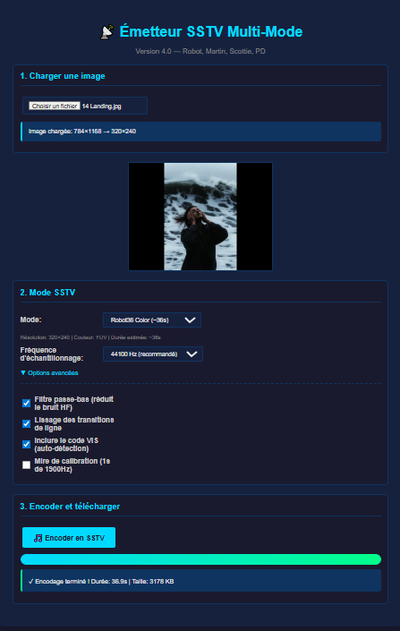

# 📻 SSTV

**Slow Scan Television encoder and decoder** — Transmit and receive images over audio, browser-based.

▶️ [Lancer l'application](index2.html)

## 🚀 Features

- **TX Mode** — Encode images to SSTV audio signals
- **RX Mode** — Decode SSTV audio back to images
- **Multiple Formats** — Martin, Scottie, Robot modes
- **Web Audio API** — Real-time audio processing
- **Microphone Input** — Decode live signals
- **Speaker Output** — Transmit via audio

## 🛠️ Tech Stack

- Pure HTML/CSS/JavaScript
- Web Audio API for signal processing
- Canvas for image manipulation
- No external dependencies

## 📖 Usage

### Transmit (TX)
1. Load an image
2. Select SSTV mode (Martin M1, Scottie S1, etc.)
3. Click transmit — audio plays through speakers

### Receive (RX)
1. Allow microphone access
2. Play SSTV audio near microphone
3. Watch the image decode line by line

## 🎓 Ham Radio

SSTV is used by amateur radio operators to transmit images over HF/VHF frequencies. This tool lets you experiment without a radio license using audio cables or acoustic coupling.

## 📄 License

MIT

## 👤 Author

**Eric PERRET** — [GitHub](https://github.com/ericperret)
